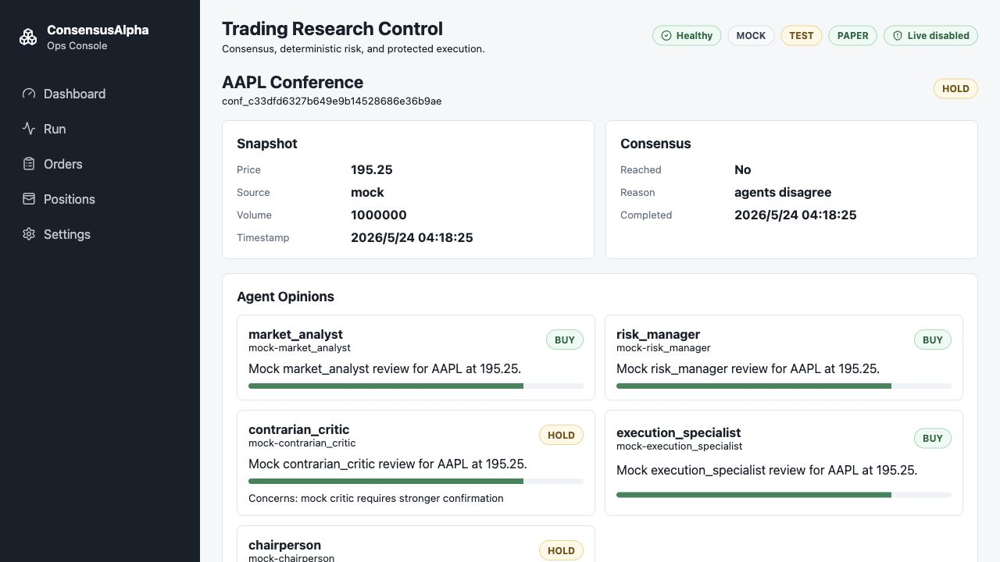

# ConsensusAlpha

ConsensusAlpha is an AI-assisted decision console for US stocks and ETFs. It scans a candidate universe, shortlists proposals, runs a multi-agent conference, applies deterministic risk gates, and routes approved decisions to paper execution or a guarded live-order preview.

## Project Overview

ConsensusAlpha is built for a simple external workflow: configure once, generate a decision, inspect the final result, and confirm only when a real order is explicitly allowed.

Main components:

- FastAPI backend with SQLite or PostgreSQL storage.
- React/Vite TypeScript console with simple and advanced views.
- Candidate scan, proposal review, agent conference, consensus, risk checks, and order routing.
- Mock broker and mock LLM defaults, so the app can run without external keys.
- Webull provider integration for configured test or production broker access.
- Paper execution, protected live-order previews, audit events, replay scripts, and model token usage tracking.

Default mode is safe: mock data, mock models, paper trading, and live trading disabled.

## Example



## Environment Dependencies

Required tools:

- Docker with Docker Compose for the recommended run path.
- Python `>=3.11,<3.14` for local backend development and tests.
- Node.js 20 or newer with Corepack/pnpm for local frontend development.
- `curl` for production preflight checks.

### macOS

Check:

```bash
docker --version
docker compose version
python3 --version
node --version
corepack --version
```

Install path:

```bash
brew install --cask docker
brew install python@3.13 node
corepack enable
```

Start Docker Desktop before running Compose commands.

### Linux

Check:

```bash
docker --version
docker compose version
python3 --version
node --version
corepack --version
```

Install Docker Engine with the Compose plugin from your distribution or Docker's official repository. Install Python 3.11-3.13 and Node.js 20+, then enable Corepack:

```bash
corepack enable
```

### Windows

Check in PowerShell:

```powershell
docker --version
docker compose version
py --version
node --version
corepack --version
```

Install Docker Desktop with WSL 2 enabled, Python 3.11-3.13, and Node.js 20+. Then run:

```powershell
corepack enable
```

## Install

Clone the repository:

```bash
git clone git@github.com:HoshiyomiLusia/ConsensusAlpha.git
cd ConsensusAlpha
```

Create local configuration files when needed:

```bash
cp .env.example .env
cp .env.test.example .env.test
cp .env.production.example .env.production
```

For local backend development:

```bash
python3 -m venv .venv
. .venv/bin/activate
python -m pip install -e '.[dev]'
```

For local frontend development:

```bash
cd frontend
pnpm install
```

## Usage

Run the default Docker environment:

```bash
docker compose -p consensusalpha-main up --build -d
```

Open `http://127.0.0.1:5173`.

Run the isolated test/UAT environment:

```bash
docker compose -p consensusalpha-test -f docker-compose.test.yml up --build -d
```

Open `http://127.0.0.1:5174`. The test API listens on `http://127.0.0.1:8001`.

Run the personal work environment:

```bash
cp .env.work.example .env.work
docker compose -p consensusalpha-work -f docker-compose.work.yml up --build -d
```

Open `http://127.0.0.1:5173`. Runtime settings are stored in the local ignored `.env.work` file.

Run local development servers:

```bash
.venv/bin/uvicorn app.main:app --reload
```

```bash
cd frontend
pnpm dev
```

Verify the project:

```bash
.venv/bin/python -m pytest
```

```bash
cd frontend
pnpm build
```

Production deployment uses `docker-compose.prod.yml` and `.env.production`:

```bash
docker compose -f docker-compose.prod.yml up --build -d
API_AUTH_TOKEN=CHANGE_ME_LONG_RANDOM_TOKEN sh scripts/production_preflight.sh
```

Real-money trading remains blocked unless the production readiness endpoint passes. Live orders are created as previews first and require explicit manual confirmation before placement. Do not commit real `.env` files, broker credentials, LLM keys, account IDs, or database dumps.
